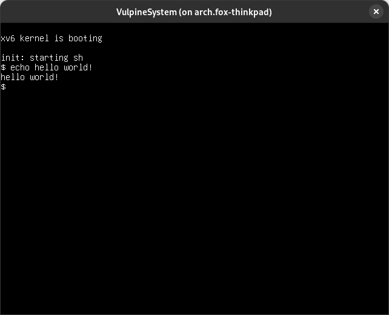

# VulpineSystem

**VulpineSystem** is a 64 bit fantasy computer based on the RISC-V architecture. It runs an extended/enhanced version of [**xv6**](https://github.com/VulpineSystem/xv6), a Unix-like operating system, and is intended to be used for learning operating system development skills.

The RISC-V emulation core is based on [semu](https://github.com/jserv/semu).

Screenshot of xv6:

## Getting Started

### Building

Simply run `make`. The resulting binary will be saved as `vulpinesystem`.

### Usage

`./vulpinesystem <raw kernel image> [<disk image>]`

The most common use case is passing the [**xv6**](https://github.com/VulpineSystem/xv6) kernel image as the first argument, and the filesystem image as the second argument: `./vulpinesystem ../xv6/kernel/xv6 ../xv6/fs.img`

### Toolchain Issues

Note that the prebuilt RISC-V toolchains are compiled with the compressed instructions extension enabled. VulpineSystem does not support compressed instructions, so you will have to build a toolchain with that extension disabled. Follow the "Installation (Newlib)" instructions [here](https://github.com/riscv-collab/riscv-gnu-toolchain), but when running the `./configure` command, add `--with-arch=rv64g`. I also recommend running `make` with `-j12` (replace 12 with how many threads your CPU has) in order to speed up the build process.

## News

I often post news about what I'm working on with VulpineSystem and xv6 on Cohost! You can find my posts about this [here](https://cohost.org/rc/tagged/vulpinesystem).

## License
This project is licensed under the [MIT license](LICENSE).
